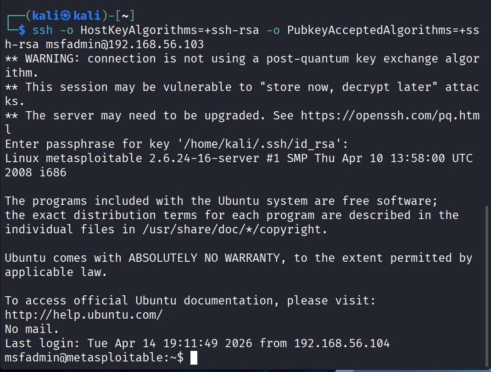
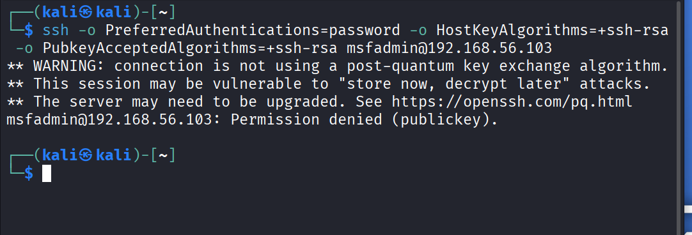
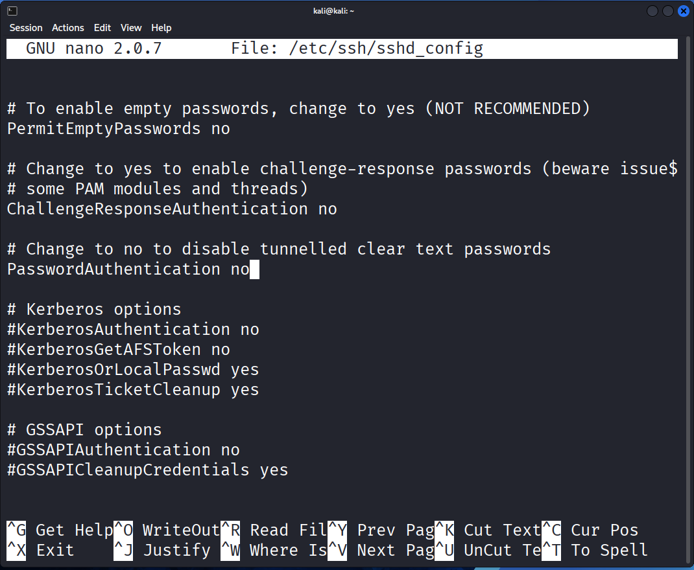

# SSH Brute Force Detection Lab

## 1. Objective
To simulate and investigate SSH brute force attacks against a Linux server by analyzing authentication logs, network traffic, and attack patterns in order to understand brute force detection and response workflows.

---

## 2. Scenario
A SOC analyst receives an alert indicating repeated failed SSH login attempts against a Linux server. The objective is to determine whether the activity represents brute force authentication attempts, assess impact, and recommend remediation.

---

## 3. Lab Setup

| Component        |    Role  |
|----------        |    ------|
| Kali Linux       | Attacker / Analyst |
| Metasploitable2  | SSH Target |

---

## 4. Baseline Authentication Log Review

Reviewed `/var/log/auth.log` prior to attack simulation to establish baseline authentication activity.

Observed:
- Normal sudo session activity
- Scheduled cron jobs
- SSH daemon logging reconnaissance-related connection anomalies

---

## 5. Findings

- Detected repeated failed SSH authentication attempts against user `msfadmin`
- Source IP `192.168.56.104` generated high-volume login failures within seconds
- PAM aggregated multiple failures, indicating automated attack behavior
- Brute-force attack successfully identified valid credentials: `msfadmin:msfadmin`
- Validated unauthorized SSH access using discovered credentials

---

## 6. MITRE ATT&CK Mapping

- T1110 – Brute Force
- T1078 – Valid Accounts

---

## 7. Remediation Verification

Re-ran brute-force attack against SSH service after implementation of SSH authentication hardening controls.

Result:
- No valid credentials discovered
- Brute-force attack unsuccessful

This confirms remediation effectively mitigated the original finding.

MITRE Mitigation:
- M1027 – Password Policies
- M1036 – Account Use Policies

---

## 8. Remediation Implementation – SSH Hardening

### 8.1 Disable Password Authentication

Following validation of successful SSH brute-force compromise against the default credential set, password-based SSH authentication was removed and replaced with SSH key-based authentication to eliminate password brute-force attack paths against the service.

#### Actions Performed
* Generated RSA 4096-bit SSH key pair on administrator workstation to support asymmetric key-based authentication
* Installed administrator public key on target Linux server within the `authorized_keys` trust store
* Validated successful SSH key-based authentication prior to enforcing hardened authentication settings
* Modified SSH daemon configuration to disable password-based authentication by setting `PasswordAuthentication no` in `sshd_config`
* Restarted SSH daemon to apply hardened authentication policy changes
* Confirmed password-only SSH authentication attempts were rejected while trusted SSH key authentication remained functional

#### Validation Evidence
* Verified successful SSH key-based login using administrator private key and protected passphrase
* Verified password-only SSH authentication attempts returned `Permission denied (publickey)`, confirming password authentication was disabled

---

**SSH Key Authentication Successful**

**Password Authentication Denied**

**SSHD Configuration Updated**

---

#### Security Outcome

Password-based SSH authentication was successfully eliminated from the exposed Linux service, removing the original brute-force attack path identified during investigation. Remote administrative access now requires possession of a trusted private SSH key, significantly increasing authentication security and reducing credential-based attack surface.

---

## 9. Tooling Challenge – Legacy SSH MAC Algorithm Incompatibility

- **Root Cause:** ...
Metasploitable2 uses outdated SSH (OpenSSH 4.x) supporting deprecated MAC algorithms.

Hydra (modern version) does not support these weak MACs by default.

- **Resolution:** ...
Switched to Ncrack, which successfully performed brute-force attack against legacy SSH service.

- **Learning:** ...
Tool compatibility with legacy systems is critical during penetration testing.

